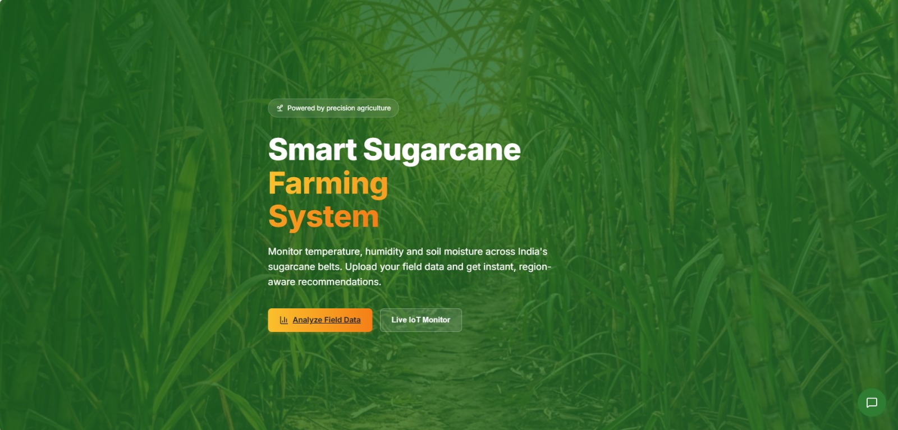
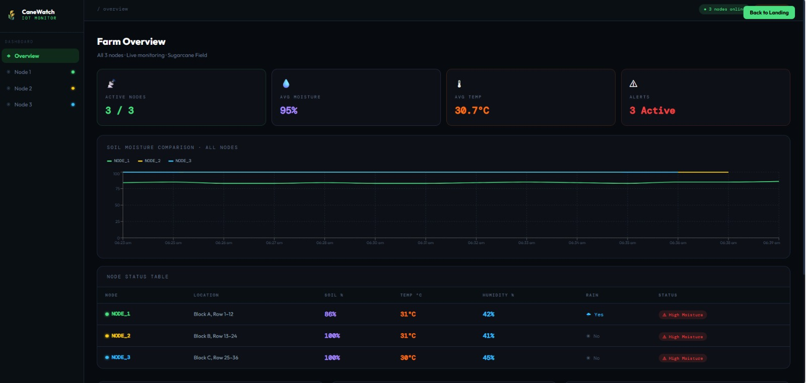
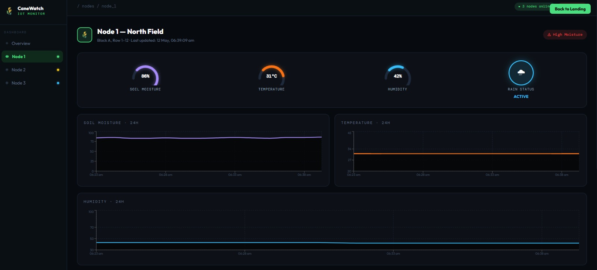
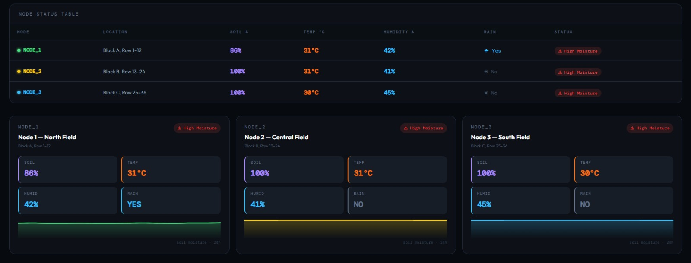
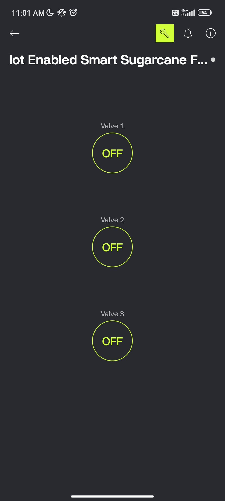
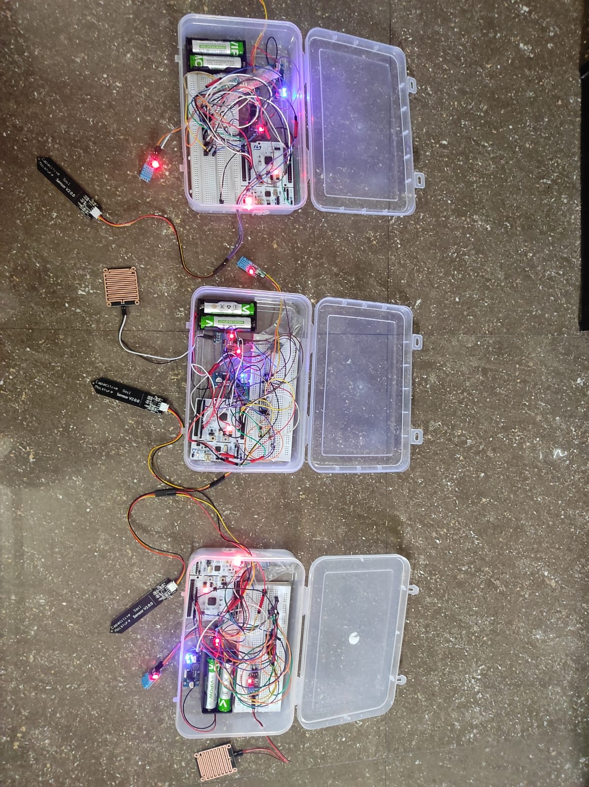
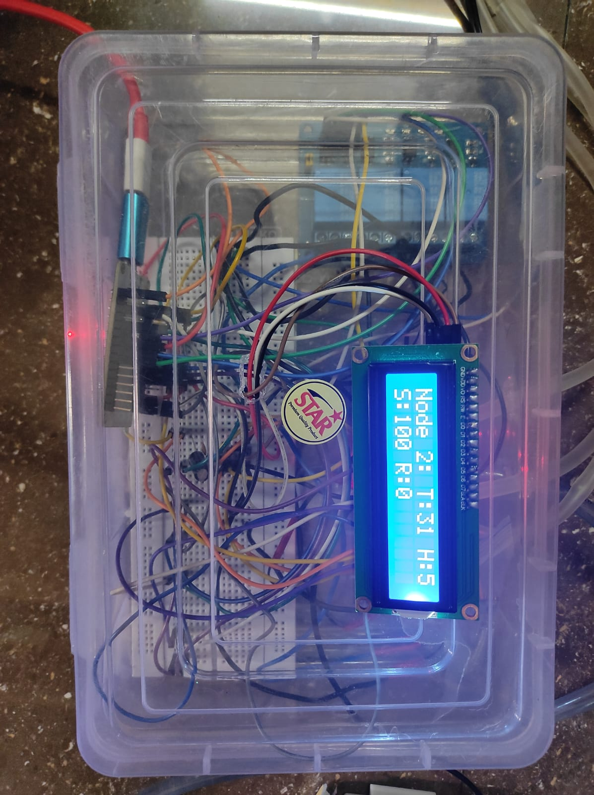

# 🌱 IoT-Enabled Smart Sugarcane Farming System

An IoT-enabled smart irrigation and environmental monitoring system developed using **STM32**, **ESP32**, **LoRa (433 MHz)**, **Supabase**, and **Blynk IoT**. The system continuously monitors environmental conditions, stores sensor data in the cloud, provides real-time visualization through a web dashboard, and enables remote irrigation control through a mobile application.

---

## 📖 Project Overview

Efficient water management is one of the major challenges in modern agriculture. This project addresses that challenge by deploying multiple wireless sensor nodes across a sugarcane field to monitor environmental conditions and assist farmers in irrigation management.

The system consists of **three STM32-based sensor nodes**, each equipped with environmental sensors and a LoRa communication module. Sensor readings are transmitted wirelessly to an **ESP32 gateway**, which displays the information locally on an LCD, uploads it to a cloud database, and enables real-time monitoring and remote irrigation control.

---

## 🏗️ System Architecture

<p align="center">
  
</p>

---

## ⚙️ Hardware Components

### Sensor Nodes (3)

Each sensor node consists of:

- STM32 Nucleo F401RE Development Board
- SX1278 LoRa Transceiver (433 MHz)
- DHT11 Temperature & Humidity Sensor
- Capacitive Soil Moisture Sensor
- Rain Sensor Module
- AMS1117 3.3V Voltage Regulator
- LM2596 Adjustable DC-DC Buck Converter
- 2 × 3.7V Li-ion Rechargeable Batteries

### Gateway Unit

The central gateway consists of:

- ESP32 Development Board
- SX1278 LoRa Transceiver (433 MHz)
- 16×2 I2C LCD Display
- 4-Channel Relay Module
- Water Pump
- Three Solenoid Valves

---

## 💻 Software & Technologies

### Embedded Development

- STM32CubeIDE
- STM32 HAL Library
- Arduino IDE

### Cloud & IoT

- Supabase
- Blynk IoT

### Communication

- LoRa (433 MHz)

### Version Control

- Git
- GitHub

---

## 🛠️ Tech Stack

| Category | Technologies |
|-----------|--------------|
| Microcontrollers | STM32 Nucleo F401RE, ESP32 |
| Communication | LoRa (433 MHz) |
| Sensors | DHT11, Capacitive Soil Moisture Sensor, Rain Sensor |
| Cloud Database | Supabase |
| Mobile Platform | Blynk IoT |
| IDEs | STM32CubeIDE, Arduino IDE |
| Version Control | Git, GitHub |

---

## 🔄 Working Principle

1. Environmental sensors continuously monitor field conditions.
2. STM32 processes the sensor readings locally.
3. Sensor data is transmitted wirelessly using LoRa (433 MHz).
4. ESP32 receives data from all sensor nodes.
5. The gateway displays the received information on a 16×2 LCD.
6. Sensor readings are uploaded to the cloud database.
7. The web dashboard displays real-time sensor data and historical trends.
8. Users can remotely monitor the system and manually control irrigation using the Blynk mobile application.
9. Relay outputs control the water pump and solenoid valves.

---

## 📊 Web Dashboard

The project includes a custom web dashboard for real-time visualization of environmental data collected from all sensor nodes.

### Landing Page

<p align="center">
  
</p>

---

### Dashboard Overview

The dashboard provides:

- Active sensor node status
- Average soil moisture
- Average temperature
- Alert monitoring
- Soil moisture comparison
- Node status table

<p align="center">
  
</p>

---

### Individual Node Monitoring

Each sensor node has a dedicated monitoring page displaying:

- Soil Moisture
- Temperature
- Humidity
- Rain Status
- Historical sensor graphs

<p align="center">
  
</p>

---

### Node Summary

A consolidated overview of all deployed sensor nodes.

<p align="center">
  
</p>

---

## 📱 Mobile Application

The project integrates with the **Blynk IoT** mobile application, allowing users to remotely monitor environmental parameters and manually control irrigation devices.

Features include:

- Live sensor monitoring
- Pump control
- Individual valve control
- Remote Internet access
- User-friendly mobile interface

<p align="center">
  
</p>

---

## 📷 Hardware Prototype

### Sensor Nodes

Three STM32-based wireless sensor nodes deployed for field monitoring.

<p align="center">
  
</p>

---

### ESP32 Gateway

The ESP32 gateway receives LoRa packets from all sensor nodes, displays sensor data on the LCD, uploads readings to the cloud, and controls irrigation hardware.

<p align="center">
  
</p>

---

## ✨ Key Features

- 🌱 Multi-node environmental monitoring
- 📡 Long-range LoRa communication (433 MHz)
- ☁️ Cloud-based sensor data storage
- 🌐 Real-time web dashboard
- 📱 Remote irrigation control using Blynk
- 📟 Local LCD monitoring
- 💧 Pump and solenoid valve control
- 📊 Historical sensor data visualization
- 🔋 Low-power wireless sensor nodes
- 🔧 Modular and scalable architecture

---

## 📂 Repository Structure

```text
IoT-Enabled-Smart-Sugarcane-Farming-System
│
├── Documentation/
│   └── Project_Report.pdf
│
├── ESP32_Gateway/
│
├── STM32_Node1/
├── STM32_Node2/
├── STM32_Node3/
│
├── Images/
│   ├── system_architecture.png
│   ├── landing_page.png
│   ├── dashboard_overview.png
│   ├── node_summary.png
│   ├── node_details.png
│   ├── hardware_setup.jpg
│   ├── esp32_gateway.jpg
│   └── blynk_dashboard.jpg
│
├── LICENSE
└── README.md
```

---

## 📄 Project Documentation

The complete project report, including methodology, implementation details, hardware design, software architecture, testing, and results, is available in the Documentation folder.

📄 [Project Report](Documentation/Project_Report.pdf)

---

## 🚀 Future Enhancements

- Automatic irrigation based on soil moisture threshold
- Weather forecast integration
- Solar-powered sensor nodes
- AI-assisted irrigation recommendations
- Mobile push notifications
- Fertilizer recommendation system
- Predictive crop analytics

---

## 📜 License

This project is licensed under the MIT License.

---

## 👥 Project Team

### Suhas Reddy
- Hardware Integration
- STM32 Sensor Node Assembly & Wiring
- ESP32 Gateway Integration
- Sensor Interfacing
- System Testing & Validation
- Project Documentation

### Sukruthi Reddy
- Hardware Integration
- STM32 Sensor Node Assembly & Wiring
- ESP32 Gateway Integration
- Sensor Interfacing
- System Testing & Validation
- Project Documentation

### Shubham Pandey
- Web Dashboard Development
- Cloud Database Integration
- Backend Development
- Frontend Development
- Dashboard Testing
- Project Documentation

### Anushka Gupta
- Web Dashboard UI Design
- Cloud Connectivity
- Data Visualization
- Software Testing
- UI Improvements
- Project Documentation

---

## ⭐ Support

If you found this project interesting or useful, consider giving this repository a ⭐ on GitHub.

Thank you for visiting this project! 🌱
