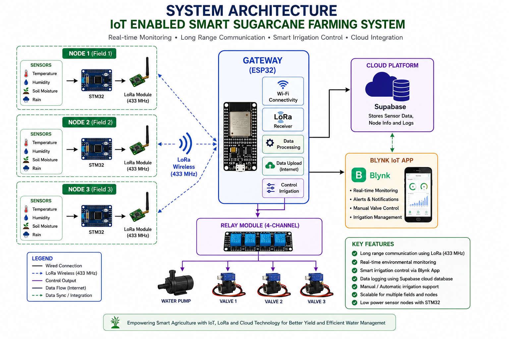

# 🌱 IoT Enabled Smart Sugarcane Farming System

An IoT-based smart farming system developed for monitoring environmental parameters and assisting irrigation management using STM32, ESP32, LoRa communication, Blynk IoT, and Supabase.

---

# 📖 Project Overview

The system consists of three distributed sensor nodes built using STM32 microcontrollers. Each node collects field data such as:

- Temperature
- Humidity
- Soil Moisture
- Rain Status

The collected information is transmitted over **LoRa (433 MHz)** to a central ESP32 gateway.

The gateway displays the received data on an LCD, uploads sensor information to the cloud database, and allows irrigation devices to be controlled remotely using the Blynk mobile application.

---

# 🏗 System Architecture



---

# ⚙ Hardware Components

## Sensor Nodes

- STM32 Nucleo F401RE
- SX1278 LoRa Module
- DHT11 Sensor
- Capacitive Soil Moisture Sensor
- Rain Sensor
- AMS1117 Voltage Regulator
- Li-ion Battery

## Gateway

- ESP32
- SX1278 LoRa Module
- 16x2 I2C LCD
- 4-Channel Relay Module
- Water Pump
- Solenoid Valves

---

# 💻 Software Used

- STM32CubeIDE
- STM32 HAL Library
- Arduino IDE
- Blynk IoT
- Supabase
- GitHub

---

# 📂 Repository Structure

```text
ESP32_Gateway/
STM32_Node1/
STM32_Node2/
STM32_Node3/
Images/
Documentation/
```

---

# 🔄 Working Principle

1. Sensor nodes collect environmental data.
2. STM32 processes the sensor readings.
3. Data is transmitted to the ESP32 gateway through LoRa.
4. ESP32 displays the received information on the LCD.
5. Sensor readings are uploaded to the cloud database.
6. The Blynk mobile application allows users to monitor sensor readings and manually control irrigation devices.
7. Irrigation devices are controlled through relay outputs.

---

# ✨ Features

- Long-range LoRa communication
- Real-time environmental monitoring
- Remote irrigation control
- Cloud data logging
- Low-power sensor nodes
- Modular multi-node architecture

---

# 🚀 Future Enhancements

- Automatic irrigation based on soil moisture threshold
- Weather forecast integration
- Solar-powered sensor nodes
- AI-based irrigation recommendations

---

# 📜 License

This project is licensed under the MIT License.

---

# 👨‍💻 Author

**Suhas Reddy**

B.E. Electronics and Communication Engineering

M. S. Ramaiah Institute of Technology
